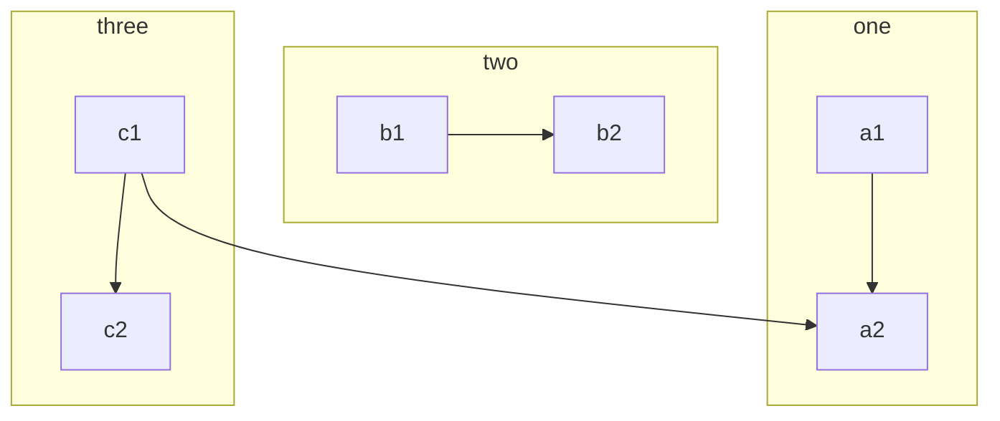

[//]: # "category: React"
[//]: # "tags: React Markdown"
[//]: # "extract: 如何支持代码语法高亮？Markdown中还可以画流程图？这里跟大家分享下我最近处理Markdown的一些经验"

最近使用 React 渲染 Markdown，进行了一些简单的探索，和大家分享下相关经验。

## 基本的 Markdown 能力

当下有许多成熟的 Markdown 库，如 marked、react-markdown 等，这里我采用的是 react-markdown。因其与 React 有更好的结合。

> react-markdown 地址：https://www.npmjs.com/package/react-markdown

其用法也比较简单：

```jsx
import React from "react";
import Markdown from "react-markdown";

export default (props) => <Markdown source={props.content} />;
```

## 代码语法高亮

如果不做任何配置，React-Markdown 会使用 `<pre>`包裹 Markdown 中的代码块。

这样虽然也能正常显示，但是没有了语法高亮的功能，不够美观。

好在 React-Markdown 中提供了自定义 renderer 的功能，可以自定义渲染逻辑。

首先，在 React-Markdown 中配置下使用自定义渲染引擎：

```jsx
import React from "react";
import Markdown from "react-markdown";

const CodeBlock = ({ language, value }) => <pre>{value}</pre>;

export default (props) => (
  <Markdown source={props.content} renderers={{ code: CodeBlock }} />
);
```

这里我们配置了使用`CodeBlock`来渲染代码块，目前还是在使用 pre 进行渲染。

然后，再在`CodeBlock`中加上语法高亮的支持。

```jsx
import React from "react";
import Markdown from "react-markdown";
import { Prism as SyntaxHighlighter } from "react-syntax-highlighter";
import { solarizedlight as codeStyle } from "react-syntax-highlighter/dist/cjs/styles/prism";

const CodeBlock = ({ language, value }) => (
  <SyntaxHighlighter language={language} style={codeStyle}>
    {value}
  </SyntaxHighlighter>
);

export default (props) => (
  <Markdown source={props.content} renderers={{ code: CodeBlock }} />
);
```

这里使用了`react-syntax-highlighter`库来做语法高亮支持。

它支持多套主题，具体可配置项参考其官方文档。

> React Syntax Highlighter 地址: https://www.npmjs.com/package/react-syntax-highlighter

## 流程图支持

有一套名为 Mermaid 的流程图库，可在 Markdown 中直接使用，但是目前在各平台的支持度不同步，React-Markdown 中也没有默认支持它。

使用 Mermaid 可以在 Markdown 中使用指令画出流程图、类图、甘特图、状态图等多种图表，方便好用，具体用法可参考其官方网站。

> Mermaid 官方网站：https://mermaid-js.github.io/mermaid/#/

Mermaid 是一套 JS 库，可以在网页中直接加载使用，我们可以稍微修改下`CodeBlock`组件，对其进行支持。

首先，在页面中加载 mermaid.min.js，并启用自动渲染功能。

可直接将其写入 html 文件中：

```html
<script src="//unpkg.com/mermaid@8.4.8/dist/mermaid.min.js"></script>
<script>
  mermaid.initialize({ startOnLoad: true });
</script>
```

如果写在 React 中，则需要处理下{}字符：

```jsx
<script src='//unpkg.com/mermaid@8.4.8/dist/mermaid.min.js' />
<script>mermaid.initialize({'{startOnLoad: true}'});</script>
```

在开启`startOnLoad: true`之后，Mermaid 会自动处理 className 中带有`mermaid`的 tag。

因此，`CodeBlock`中可以做如下的修改：

```jsx
import React from 'react'
import Markdown from 'react-markdown'
import { Prism as SyntaxHighlighter } from 'react-syntax-highlighter'
import { solarizedlight as codeStyle } from 'react-syntax-highlighter/dist/cjs/styles/prism'

const CodeBlock = ({ language, value }) => (
  language === 'mermaid'
    ? return <div className='mermaid'>{value}</div>
    : <SyntaxHighlighter language={language} style={codeStyle}>
      {value}
    </SyntaxHighlighter>
)

export default props => (
  <Markdown
    source={props.content}
    renderers={{ code: CodeBlock }}
  />
)
```

至此，大功告成。

最后，放个示例 mermaid，大家看看效果：


